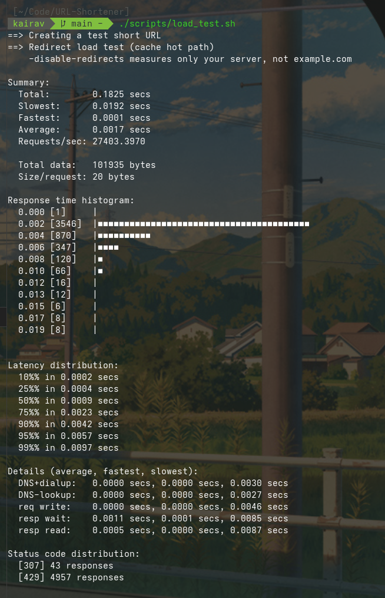
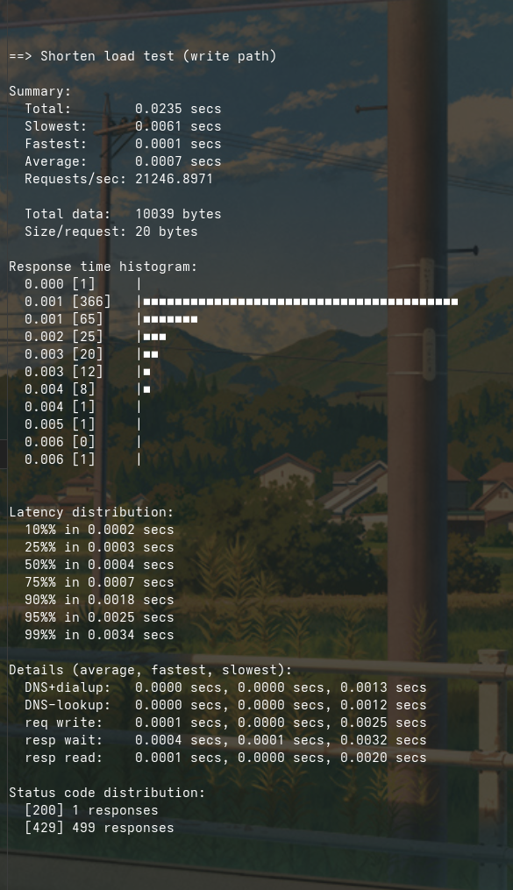
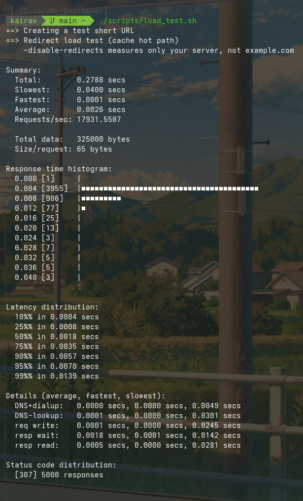
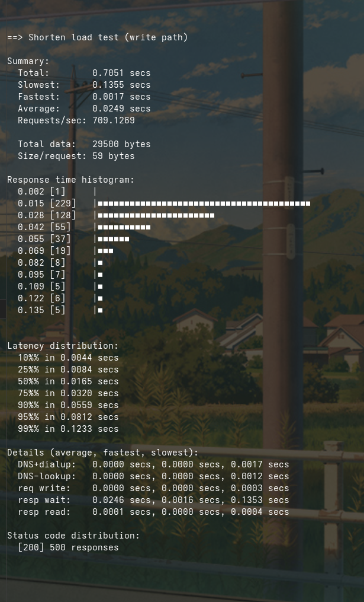
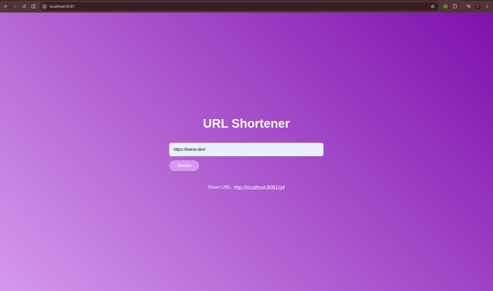

# Scalable URL Shortening Service

A Go backend that shortens URLs, redirects with caching, and stays safe under concurrent load.

## Run

```bash
go run ./cmd
```

Open `http://localhost:8081` for the UI, or use curl:

```bash
curl -X POST http://localhost:8081/shorten \
  -H "Content-Type: application/json" \
  -d '{"url":"https://example.com"}'
```

## Architecture

```
Client (HTML / curl)
        ↓
HTTP API (net/http)
        ↓
Rate Limiter → Cache → DB
        ↓
Short Code Generator (atomic-safe)

Data flow model:
Request
  -> Rate limiter (drop if too fast)
  -> Logger
  -> Handler
      POST /shorten -> validate URL -> generate code -> save DB -> cache it
      GET /{code}   -> check cache -> else DB -> cache it -> redirect
```

## Features

- REST APIs for shorten and redirect
- Collision-safe Base62 short codes (atomic counter)
- SQLite persistence with restart-safe ID recovery
- Token-bucket rate limiting (per client IP)
- In-memory LRU cache for hot redirects
- Health and readiness probes
- Load testing script with `hey`
- Graceful shutdown

Mainly:
No collisions -> atomic counter + Base62, not random strings.
Restart safe -> on startup, max ID is read from DB so codes never repeat.
Cache -> redirects are read-heavy; LRU keeps hot URLs out of SQLite.
Rate limit -> token bucket per IP stops abuse without blocking normal traffic.

## Example Flow

### Flow 1: Shortening a URL (POST /shorten):

- Client sends: {"url": "https://example.com"}
- Rate limiter checks if the IP is sending too many requests.
- Handler parses the JSON.
- Service validates the URL (must be http or https).
- Generator creates a unique short code using an atomic counter + Base62 (a, b, … 9, ba, …).
- Storage saves short_code → long_url in urls.db.
- Cache stores the mapping in memory.
- Response: {"short_code":"b","short_url":"http://localhost:8081/b"}

### Flow 2: Opening a short link (GET /b)

- User visits http://localhost:8081/b
- Handler extracts b from the path.
- Service checks cache first.
- If not cached, reads from urls.db and caches it.
- Handler sends HTTP redirect (307) to the long URL.
- Redirects are read-heavy, so the cache avoids hitting the DB on every click.

### Flow 3: Restart safety

- On startup in main.go:
- Open urls.db
- Find the last short code used
- Resume the counter from there
- So after restart you don’t reuse old short codes.

## Endpoints

| Method | Path           | Description                        |
| ------ | -------------- | ---------------------------------- |
| POST   | `/shorten`     | Create a short URL                 |
| GET    | `/{shortCode}` | Redirect to the long URL           |
| GET    | `/health`      | Liveness check                     |
| GET    | `/ready`       | Readiness check (includes DB ping) |
| GET    | `/`            | Simple web UI                      |

### Request / Response

```json
POST /shorten
{ "url": "https://example.com" }

Response
{
  "short_code": "b",
  "short_url": "http://localhost:8081/b"
}
```

## Load Testing

Install [hey](https://github.com/rakyll/hey):

```bash
go install github.com/rakyll/hey@latest
```

**Step 1 - start server with rate limits raised** (so the benchmark measures throughput, not 429s):

```bash
RATE_PER_SEC=10000 RATE_BURST=10000 go run ./cmd
```

**Step 2 - run the script** in another terminal:

```bash
export PATH="$PATH:$HOME/go/bin"
chmod +x scripts/load_test.sh
./scripts/load_test.sh
```

Look for `[307]` on the redirect test and `[200]` on the shorten test. If you see mostly `[429]`, the rate limiter is blocking the benchmark, use the env vars above.

Typical results on a local machine (with bench env vars):

- **Redirect (cached):** ~15k–25k req/s, p99 under 10ms
- **Shorten (write):** limited by SQLite writes (~500–1500 req/s)

The script uses `-disable-redirects` so `hey` only measures your server latency, not an external URL fetch.

Restart the server **without** the bench env vars and re-run the last section of the script to verify rate limiting returns `429` under burst traffic.

## Load Testing Results

### With Rate Limiting Enabled
**Configuration**
- Token bucket rate limiter
- Refill rate: **20 requests/second**
- Burst capacity: **40 requests**

#### Redirect Endpoint (Cached Read Path)

| Metric | Value |
|----------|----------|
| Requests | 5000 |
| Concurrency | 50 |
| Successful Redirects (307) | 43 |
| Rate-Limited Responses (429) | 4957 |
| p95 Latency | 5.7 ms |
| p99 Latency | 9.7 ms |

#### URL Creation Endpoint (Write Path)

| Metric | Value |
|----------|----------|
| Requests | 500 |
| Concurrency | 20 |
| Successful Responses (200) | 1 |
| Rate-Limited Responses (429) | 499 |
| p95 Latency | 2.5 ms |
| p99 Latency | 3.4 ms |

### Without Rate Limiting (Benchmark Mode)
**Configuration**
- Refill rate: **10000 requests/second**
- Burst capacity: **10000 requests**

#### Redirect Endpoint (Cached Read Path)

| Metric | Value |
|----------|----------|
| Requests | 5000 |
| Concurrency | 50 |
| Throughput | ~17,931 req/sec |
| Success Rate | 100% |
| p95 Latency | 7.0 ms |
| p99 Latency | 13.9 ms |

#### URL Creation Endpoint (Write Path)

| Metric | Value |
|----------|----------|
| Requests | 500 |
| Concurrency | 20 |
| Throughput | ~709 req/sec |
| Success Rate | 100% |
| p95 Latency | 81.2 ms |
| p99 Latency | 123.3 ms |


## Screenshots







## Project Structure

```
url-shortener/
├── cmd/main.go                 # wires everything together
├── internal/
│   ├── api/                    # handlers, routes, logging middleware, HTTP layer
│   ├── cache/                  # LRU cache
│   ├── health/                 # /health and /ready
│   ├── ratelimit/              # token-bucket limiter
│   ├── shortener/              # ID generator and service logic
│   └── storage/                # Store interface and SQLite
├── scripts/load_test.sh        # benchmarks
├── web/index.html              # UI
└── README.md
```

## Tests

```bash
go test ./...
```

## License

MIT
